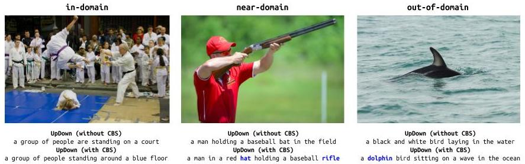

Attention for Novel Object Captioning (ANOC)
=====================================

This code implements the Attention for Novel Object Captioning (ANOC)

Reference
------------------
If you use our code or data, please cite our paper:
```text
Anonymous submission for ECCV 2020, paper ID 865.
```

Disclaimer
------------------
We adopt the official implementation of the [`nocaps`](https://github.com/nocaps-org/updown-baseline) as a baseline model for novel object captioning. We use the bottom-up features provided in this repository. Please refer to these links for further README information.

Requirements
------------------
1. Requirements for Pytorch. We use Pytorch 1.1.0 in our experiments.
2. Requirements for Tensorflow. We only use the tensorboard for visualization.
3. Python 3.6+ (for most of our experiments)

ANOC
------------------
The program can be executed by
```text
CUDA_VISIBLE_DEVICES=0 python scripts/train.py --config configs/updown_plus_cbs_saliency_nocaps_val.yaml \
--checkpoint-every 1000 --gpu-ids 0 --serialization-dir checkpoints/anoc
```

If you would like to train with SCST, you can base on the previous best result and execute the following script
```text
CUDA_VISIBLE_DEVICES=0 python scripts/train_scst.py --config configs/updown_plus_cbs_saliency_nocaps_val.yaml \
--config-override OPTIM.BATCH_SIZE 50 OPTIM.LR 0.00005 OPTIM.NUM_ITERATIONS 210000 --checkpoint-every 3000 \
--gpu-ids 0 --serialization-dir checkpoints/anoc_scst \
--start-from-checkpoint checkpoints/anoc/checkpoint_best.pth
```

Results
------------------
### ANOC w/o SCST:
<table>
  <tr>
    <th colspan="2">in-domain</th>
    <th colspan="2">near-domain</th>
    <th colspan="2">out-of-domain</th>
    <th colspan="6">overall</th>
  </tr>
  <tr>
    <th>CIDEr</th><th>SPICE</th>
    <th>CIDEr</th><th>SPICE</th>
    <th>CIDEr</th><th>SPICE</th>
    <th>BLEU1</th><th>BLEU4</th><th>METEOR</th><th>ROUGE</th><th>CIDEr</th><th>SPICE</th>
  </tr>
  <tr>
    <td>79.9</td><td>12.0</td>
    <td>75.2</td><td>11.6</td>
    <td>70.7</td><td>9.7</td>
    <td>76.6</td><td>18.6</td><td>24.2</td><td>51.9</td><td>75.0</td><td>11.3</td>
  </tr>
</table>

### ANOC with SCST:
<table>
  <tr>
    <th colspan="2">in-domain</th>
    <th colspan="2">near-domain</th>
    <th colspan="2">out-of-domain</th>
    <th colspan="6">overall</th>
  </tr>
  <tr>
    <th>CIDEr</th><th>SPICE</th>
    <th>CIDEr</th><th>SPICE</th>
    <th>CIDEr</th><th>SPICE</th>
    <th>BLEU1</th><th>BLEU4</th><th>METEOR</th><th>ROUGE</th><th>CIDEr</th><th>SPICE</th>
  </tr>
  <tr>
    <td>86.1</td><td>12.0</td>
    <td>80.7</td><td>11.9</td>
    <td>73.7</td><td>10.1</td>
    <td>78.4</td><td>19.1</td><td>24.8</td><td>52.2</td><td>80.1</td><td>11.6</td>
  </tr>
</table>

Baseline model for [`nocaps`][1] benchmark, a re-implementation based on the
[UpDown image captioning model trained on the COCO dataset (only)](https://github.com/peteanderson80/up-down-captioner),
and with added support of decoding using [Constrained Beam Search][8].



If you find this code useful, please consider citing:

```text
@inproceedings{nocaps2019,
  author    = {Harsh Agrawal* and Karan Desai* and Yufei Wang and Xinlei Chen and Rishabh Jain and
             Mark Johnson and Dhruv Batra and Devi Parikh and Stefan Lee and Peter Anderson},
  title     = {{nocaps}: {n}ovel {o}bject {c}aptioning {a}t {s}cale},
  booktitle = {International Conference on Computer Vision (ICCV)},
  year      = {2019}
}
```

As well as the paper that proposed this model: 

```text
@inproceedings{Anderson2017up-down,
  author    = {Peter Anderson and Xiaodong He and Chris Buehler and Damien Teney and Mark Johnson
               and Stephen Gould and Lei Zhang},
  title     = {Bottom-Up and Top-Down Attention for Image Captioning and Visual Question Answering},
  booktitle = {CVPR},
  year      = {2018}
}
```

Usage Instructions
------------------

1. [How to setup this codebase?][2]
2. [How to train your captioner?][3]
3. [How to evaluate or run inference?][4]

Extensive documentation available at [nocaps.org/updown-baseline](https://nocaps.org/updown-baseline).
Use it as an API reference to navigate through and build on top of our code.


Results
-------

Pre-trained checkpoints with the provided configs in (`configs` directory) are available to download:

### UpDown Captioner (no CBS):

- Checkpoint (`.pth` file): [updown.pth](https://www.dropbox.com/s/0ueshhdysc8oqyq/updown.pth)
- Predictions on `nocaps val`: [updown_nocaps_val.json](https://www.dropbox.com/s/caewx67vbd5qe9c/updown_nocaps_val.json)

**Note:** While CBS is inference-only technique, it cannot be used on this checkpoint. CBS
requires models to have 300-dimensional froze GloVe embeddings, this checkpoint has 1000-
dimensional word embeddings which are learned during training.

<table>
  <tr>
    <th colspan="2">in-domain</th>
    <th colspan="2">near-domain</th>
    <th colspan="2">out-of-domain</th>
    <th colspan="6">overall</th>
  </tr>
  <tr>
    <th>CIDEr</th><th>SPICE</th>
    <th>CIDEr</th><th>SPICE</th>
    <th>CIDEr</th><th>SPICE</th>
    <th>BLEU1</th><th>BLEU4</th><th>METEOR</th><th>ROUGE</th><th>CIDEr</th><th>SPICE</th>
  </tr>
  <tr>
    <td>78.1</td><td>11.6</td>
    <td>57.7</td><td>10.3</td>
    <td>31.3</td><td>8.3</td>
    <td>73.7</td><td>18.3</td><td>22.7</td><td>50.4</td><td>55.3</td><td>10.1</td>
  </tr>
</table>


### UpDown Captioner + Constrained Beam Search:

- Checkpoint (`.pth` file): [updown_plus_cbs.pth](https://www.dropbox.com/s/dajlwdn22betk4a/updown_plus_cbs.pth)

**Note:** Since CBS is inference-only technique, this particular checkpoint can be used
without CBS decoding. It yields similar results to the UpDown Captioner trained using
learned word embeddings during training.

#### With CBS Decoding:

- Predictions on `nocaps val`: [updown_plus_cbs_nocaps_val_with_cbs.json](https://www.dropbox.com/s/gwehyfaijfpi5tj/updown_plus_cbs_nocaps_val_with_cbs.json)

<table>
  <tr>
    <th colspan="2">in-domain</th>
    <th colspan="2">near-domain</th>
    <th colspan="2">out-of-domain</th>
    <th colspan="6">overall</th>
  </tr>
  <tr>
    <th>CIDEr</th><th>SPICE</th>
    <th>CIDEr</th><th>SPICE</th>
    <th>CIDEr</th><th>SPICE</th>
    <th>BLEU1</th><th>BLEU4</th><th>METEOR</th><th>ROUGE</th><th>CIDEr</th><th>SPICE</th>
  </tr>
  <tr>
    <td>78.6</td><td>12.1</td>
    <td>73.5</td><td>11.5</td>
    <td>68.8</td><td>9.8</td>
    <td>75.8</td><td>17.5</td><td>22.7</td><td>51.1</td><td>73.3</td><td>11.3</td>
  </tr>
</table>

#### Without CBS Decoding:

- Predictions on `nocaps val`: [updown_plus_cbs_nocaps_val_without_cbs.json](https://www.dropbox.com/s/12kwcciw9t1mldt/updown_plus_cbs_nocaps_val_without_cbs.json)

<table>
  <tr>
    <th colspan="2">in-domain</th>
    <th colspan="2">near-domain</th>
    <th colspan="2">out-of-domain</th>
    <th colspan="6">overall</th>
  </tr>
  <tr>
    <th>CIDEr</th><th>SPICE</th>
    <th>CIDEr</th><th>SPICE</th>
    <th>CIDEr</th><th>SPICE</th>
    <th>BLEU1</th><th>BLEU4</th><th>METEOR</th><th>ROUGE</th><th>CIDEr</th><th>SPICE</th>
  </tr>
  <tr>
    <td>75.7</td><td>11.7</td>
    <td>58.0</td><td>10.3</td>
    <td>32.9</td><td>8.2</td>
    <td>73.1</td><td>18.0</td><td>22.7</td><td>50.2</td><td>55.4</td><td>10.1</td>
  </tr>
</table>


[1]: https://nocaps.org
[2]: https://nocaps.org/updown-baseline/setup_dependencies.html
[3]: https://nocaps.org/updown-baseline/training.html
[4]: https://nocaps.org/updown-baseline/evaluation_inference.html

[5]: https://github.com/nocaps-org/updown-baseline/blob/master/updown/utils/checkpointing.py
[6]: https://github.com/nocaps-org/updown-baseline/blob/master/updown/config.py
[7]: https://arxiv.org/abs/1707.07998
[8]: https://arxiv.org/abs/1612.00576
